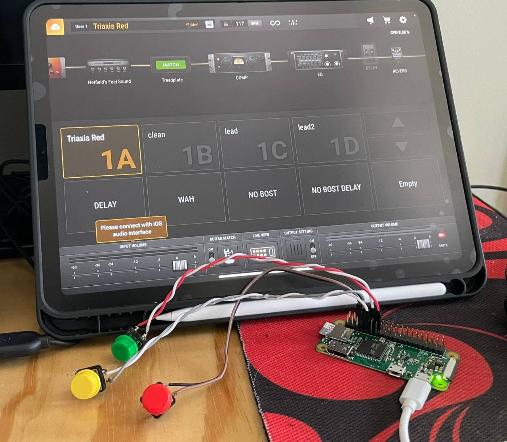
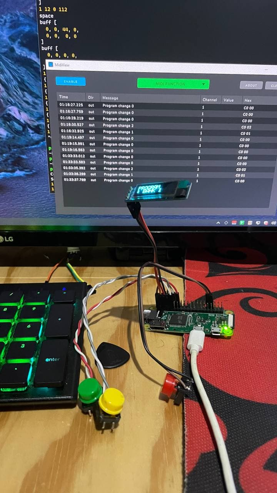
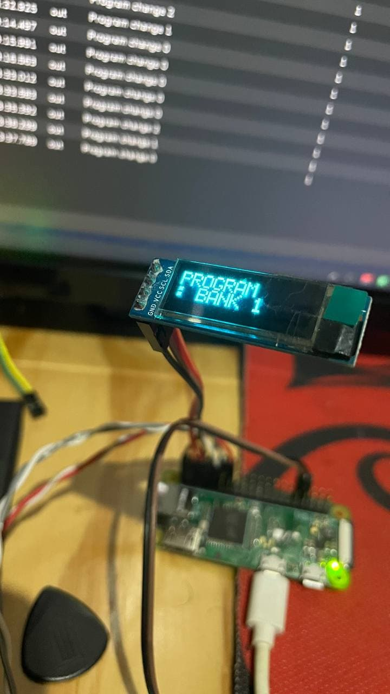

# Raspberry Pi Zero W MIDI Controller with NodeJS

Turn your Raspberry Pi W to powerfull Midi and Automation Controller for Music Productive or your key macros.

_Installation and behind the scene coming soon..._

## Preview

Allows Control MIDI via Bluetooth

Also Send MIDI or Keyboard Strokes Message through USB Gadgets (g_midi and HID (Human Interface Device) emulation)

Full Customize Presets depends on your GPIO inputs

_- NurulFikri 2021_
